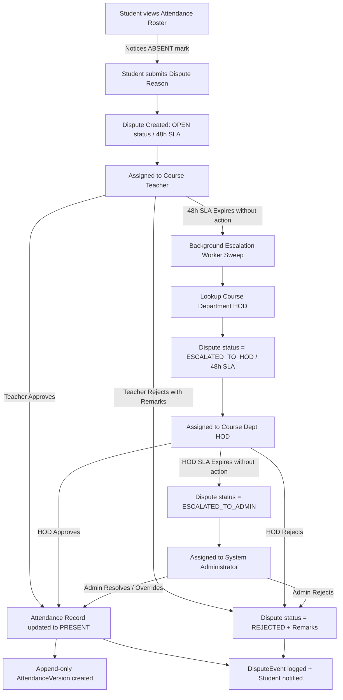

# 🎓 DigiCampus — Campus Attendance Dispute & SLA Escalation System

> A production-engineered academic coordination platform that provides attendance correction, student dispute management, SLA-based escalation, auditability, and proactive notifications.

---

## 🎯 1. Problem Statement & Real-World Motivation

> *"In my college, I attended a lecture, took notes, and was physically in the room. But when the professor submitted the roster, I was accidentally marked **ABSENT**.*
> 
> *I only found out days later because **the portal never proactively alerted me**. When I tried to correct it, I realized there was no digital button or formal mechanism to report a mistake.*
> 
> *I had to message the professor on WhatsApp and visit their staff cabin. The professor said, 'I’ll check later' — and forgot. There was no deadline, no tracking, and no way for me to escalate. When exam hall-ticket eligibility came around, that single wrong absence put me at risk of falling below the 75% threshold."*

---

### The 4 Core Coordination Breakdowns

This personal experience highlighted four fundamental coordination gaps on college campuses:

1. **The Silent Failure Breakdown**: Attendance was submitted, but the student was never notified. Students had to manually log in and hunt through tables to find discrepancies.
2. **The WhatsApp / Hallway Chaser**: Corrections depended on informal messages, paper notes, or hallway conversations that had zero auditability and got lost.
3. **The Absence of SLA & Ownership**: Nobody had a deadline to resolve the issue. If the professor was busy or forgot, the request stayed pending indefinitely.
4. **The Cross-Department Bottleneck**: When a Computer Science student had an issue in a Mathematics class, they didn't know whether to approach the CSE HOD or the Math HOD.

### The DigiCampus Solution

DigiCampus transforms what used to be a frustrating, unrecorded WhatsApp conversation into an accountable, multi-tiered digital workflow:

- **Immediate In-App & Email Alerts**: The moment a student is marked absent, they are notified across in-app channels and campus email.
- **1-Click Direct Dispute**: A **"Raise Dispute"** action is attached directly to the absent record.
- **48-Hour SLA Engine**: Every dispute has a designated owner and a countdown timer.
- **Course-Based Automatic Escalation**: If unresolved after 48h, the system automatically escalates to the **Course Department HOD**, then the **System Administrator**.
- **Immutable Audit Ledger**: Every approval, rejection reason, and attendance correction is permanently preserved in versioned logs.

> **Implementation Note:** In-app alerts, transactional email queuing, SMTP delivery, and Celery-based retry workers are fully implemented in this repository. WhatsApp and SMS delivery channels are architecturally supported for future integrations requiring third-party institutional gateway credentials.

---

## 🔄 2. Existing Workflow vs Proposed DigiCampus Workflow

| Existing Problem | DigiCampus Workflow |
| :--- | :--- |
| Student may not know they were marked absent | Student receives an immediate in-app notification & queued email |
| Incorrect attendance can remain unresolved | Student can raise a dispute directly from the attendance record |
| Correction depends on manually contacting faculty | Structured teacher review queue with mandatory rejection reasons |
| No defined response deadline | SLA-based resolution deadline (48-hour SLA) |
| Unresolved teacher dispute can remain pending | Automatic background escalation to Course Department HOD |
| HOD-level dispute can remain unresolved | Automatic background escalation to System Administrator |
| Attendance corrections may lack transparent history | Immutable `AttendanceVersion` ledger and `DisputeEvent` audit trail |
| Students must manually check notifications | Notifications delivered through in-app center + campus email outbox |
| Failed email delivery can be silently lost | Transactional email outbox with automatic retry handling (3 attempts) |

---

## 🧑🎓 3. Example Scenario: Cross-Department Discipline

Consider a **Computer Science & Engineering (CSE)** student enrolled in `MA101 — Engineering Mathematics`:

1. The student attends the Mathematics lecture in Lecture Hall B.
2. The faculty member (`Prof. Carl Gauss`) accidentally marks the student as `ABSENT`.
3. The attendance roster is finalized and published.
4. **DigiCampus immediately triggers an in-app notification** and queues an institutional email for the student.
5. The student logs in, opens **My Attendance**, and selects **⚖️ Raise Dispute** on the absent record.
6. The dispute is created with status `OPEN` and assigned to `Prof. Carl Gauss` with a **48-hour SLA**.
7. The faculty member can:
   - **Approve Dispute** $\rightarrow$ attendance atomically changes from `ABSENT` to `PRESENT`, and an `AttendanceVersion` record is saved.
   - **Reject Dispute** $\rightarrow$ rejection strictly requires mandatory academic remarks.
8. If the faculty member does not resolve the dispute within the 48-hour SLA, the background worker automatically escalates the dispute to **Dr. Isaac Newton (Science & Humanities HOD)**, because `MA101` belongs to Science & Humanities.
9. If the HOD also does not resolve it within their 48-hour SLA, the dispute automatically escalates to the **System Administrator** for final resolution.
10. Every state transition, timestamp, and remark is immutably recorded in the **Audit Ledger**.

---

## ⚡ 4. Core Domain Rule: Course-Based Ownership & Escalation

Dispute routing and escalation are strictly anchored to **Course Ownership**, **NOT** the student's home department.

```text
Dispute → Attendance Record → Course → Course Department → Department HOD
```

### Why Course Ownership Matters
Each curriculum course belongs to an academic department that supervises the faculty instructors assigned to teach that subject. If a course instructor fails to resolve a student's attendance dispute within the **48-hour SLA**, the escalation must route to the **HOD of the department that owns the course** so the supervising authority can take action.

- **Student Department**: `Computer Science & Engineering (CSE)`
- **Course**: `MA101 — Engineering Mathematics` (Owned by `Science & Humanities`)
- **Assigned Teacher**: `Prof. Carl Gauss` (Faculty in `Science & Humanities`)
- **Stage 1 Escalation Target**: **Dr. Isaac Newton (S&H HOD)** — The CSE HOD is explicitly NOT assigned or escalated to, preserving cross-departmental accountability.

---

## 🏗️ 5. System Architecture & Workflow



---

## ⚙️ 6. Background Processing Architecture

Periodic background tasks (SLA escalation sweeps, email outbox processing) are driven by **Celery + Redis + Celery Beat** — not by FastAPI.

```
FastAPI (HTTP requests only)
      |
      v
    MySQL

Celery Beat (scheduler)
      |
      v
    Redis (broker)
      |
      v
Celery Worker (task execution)
      |
      +---------> MySQL (dispute state, audit events)
      +---------> SMTP Server (email delivery)
```

| Service | Responsibility |
|:---|:---|
| **FastAPI** | Serves HTTP API requests; creates DB transactions; admin manual trigger still available |
| **Redis** | Celery broker (DB 0) and result backend (DB 1); no application data stored in Redis |
| **Celery Beat** | Runs in its own container; enqueues periodic tasks on schedule |
| **Celery Worker** | Executes `process_sla_escalations` and `process_email_outbox_task` tasks |
| **MySQL** | Only persistent application data store |
| **SMTP** | External email delivery (optional; unconfigured = outbox entries retained) |

### Default Schedule (configurable via environment variables)

| Task | Default Interval | Environment Variable |
|:---|:---|:---|
| SLA Escalation Sweep | Every 60 seconds | `ESCALATION_WORKER_INTERVAL_SECONDS` |
| Email Outbox Processing | Every 30 seconds | `EMAIL_OUTBOX_INTERVAL_SECONDS` |

### Idempotency Guarantee
All background tasks wrap the existing `process_overdue_escalations()` and `process_email_outbox()` service functions. These functions:
- Use `SELECT ... FOR UPDATE` row locking to prevent race conditions
- Are idempotent: running twice produces the same result
- Do not duplicate dispute events, notifications, or ownership changes

---

## 🔔 7. Notification Architecture

When an attendance record is submitted as `ABSENT`:

```text
                    Faculty submits attendance
                              │
                              ▼
                     Attendance Record
                         (ABSENT)
                              │
                 ┌────────────┴────────────┐
                 ▼                         ▼
        In-App Notification          Email Outbox Queue
                 │                         │
                 ▼                         ▼
        Notification Center          SMTP Worker Service
        (Bell + Alerts Page)               │
                                  ┌────────┴────────┐
                                  ▼                 ▼
                                SENT             FAILED
                                                    │
                                                    ▼
                                               Retry Queue (Max 3)
```

The notification workflow is asynchronous for email delivery, preventing external SMTP delays or network failures from blocking core attendance transactions.

---

## 🛡️ 8. Security, RBAC & Hardening Features

- **Authoritative JWT Authentication**: Cryptographic token verification on all protected endpoints with `HS256` signatures.
- **Server-Side RBAC**: Strict role enforcement across all routes (`STUDENT`, `TEACHER`, `HOD`, `ADMIN`). Frontend state is never trusted as authentication.
- **No Demo Role Switchers**: Authentic login via verified credentials; no mock role bypasses.
- **Password Security**: Passwords are securely hashed with `bcrypt`.
- **Resource-Level Authorization**:
  - Students can only view their own attendance and dispute history (`HTTP 403 Forbidden` for cross-student access).
  - Teachers can only mutate disputes for courses assigned to them.
  - HODs can only access disputes escalated to their department queue.
  - Administrative endpoints strictly reject non-admin users.
- **Transactional & Atomic Mutations**: Attendance corrections, dispute status transitions, and version logs execute in single ACID transactions (`with_for_update()` row locking prevents race conditions and duplicate actions).
- **Audit Ledger Immutability**: All lifecycle events (`DISPUTE_CREATED`, `DISPUTE_APPROVED`, `DISPUTE_REJECTED`, `ESCALATED_TO_HOD`, `ESCALATED_TO_ADMIN`, `ATTENDANCE_CORRECTED`) are append-only.
- **Input Validation**: Pydantic schemas enforce type safety and reject empty or whitespace-only rejection remarks (`HTTP 400 Bad Request`).

---

## 👥 9. Role Capabilities & Portals

| Role | Responsibilities | Key Portal Pages |
| :--- | :--- | :--- |
| **STUDENT** | View presence percentage, monitor 75% statutory attendance threshold, raise disputes on absent records, track live SLA countdown, and view audit history. | `/student`, `/student/attendance`, `/student/disputes`, `/student/notifications` |
| **TEACHER** | Schedule class lecture sessions, mark student rosters (`PRESENT`/`ABSENT`), review assigned disputes, approve with atomic attendance correction, or reject with mandatory remarks. | `/teacher`, `/teacher/attendance`, `/teacher/disputes`, `/teacher/notifications` |
| **HOD** | Department-level dashboard, monitor department course offerings, handle faculty 48h SLA breaches, and approve/reject escalated disputes. | `/hod`, `/hod/disputes`, `/hod/notifications` |
| **ADMIN** | System-wide dispute monitoring, manual SLA escalation execution, email outbox batch processing, user directory, course catalog, department hierarchy, correction window scheduling, and audit log inspection. | `/admin`, `/admin/users`, `/admin/courses`, `/admin/departments`, `/admin/correction-windows`, `/admin/disputes`, `/admin/audit`, `/admin/email-outbox` |

---

## 🔑 10. Evaluation Demo Accounts

Pre-seeded credentials for evaluators (passwords hashed with `bcrypt`):

| Role | Name | Email | Password | Department Context |
| :--- | :--- | :--- | :--- | :--- |
| **ADMIN** | System Administrator | `admin@digiicampus.com` | `admin123` | Institutional Oversight |
| **HOD (CSE)** | Dr. Alan Turing | `hod.cse@digiicampus.com` | `hod123` | Computer Science & Engineering |
| **HOD (S&H)** | Dr. Isaac Newton | `hod.sh@digiicampus.com` | `hod123` | Science & Humanities |
| **TEACHER (CSE)** | Prof. Donald Knuth | `teacher.cse@digiicampus.com` | `teacher123` | Computer Science (`CS101`) |
| **TEACHER (Math)** | Prof. Carl Gauss | `teacher.math@digiicampus.com` | `teacher123` | Science & Humanities (`MA101`) |
| **STUDENT (CSE)** | Karan Student | `student.cse@digiicampus.com` | `student123` | Enrolled in `CS101` & `MA101` |

---

## 🚀 11. Fresh Clone & Setup Instructions

### Prerequisites
- Docker & Docker Compose (or Python 3.10+ and Node.js 18+ for local execution)
- MySQL 8.0 (if running locally without Docker)
- Redis 7 (if running locally without Docker)

### Option A: Running with Docker Compose (Recommended)

From the root directory:

```bash
# Build and start all 6 services:
# MySQL, Redis, FastAPI Backend, Celery Worker, Celery Beat, React Frontend
docker compose up --build
```

> **Seed Data**: Migrations (`alembic upgrade head`) and seed data (`python seed.py`) run **automatically** inside the backend container on startup. No manual steps are required. The seed script is idempotent — running it on an already-seeded database is safe.

Services will be available at:
- **Frontend Web Application**: [http://localhost:3000](http://localhost:3000)
- **FastAPI REST API**: [http://localhost:8000](http://localhost:8000)
- **Interactive Swagger Documentation**: [http://localhost:8000/docs](http://localhost:8000/docs)
- **MySQL Database**: `localhost:3306`
- **Redis**: `localhost:6379`

### Option B: Local Development Setup

#### 1. Backend Setup
```bash
cd backend
python -m venv venv
# On Windows:
venv\Scripts\activate
# On Linux/macOS:
source venv/bin/activate

pip install -r requirements.txt
alembic upgrade head
python seed.py
uvicorn app.main:app --reload --port 8000
```

#### 2. Frontend Setup
```bash
cd frontend
npm install
npm run dev
# App starts at http://localhost:5173
```

---

## 🧪 12. Automated Testing & Verification

### Running Backend Test Suite
```bash
cd backend
pytest -v
```

**Verified Test Result**:
```text
============================= 50 passed in 26.43s =============================
- tests/test_auth.py (5 tests passed)
- tests/test_domain_relationships.py (2 tests passed)
- tests/test_escalation_and_m2_workflows.py (5 tests passed)
- tests/test_health.py (1 test passed)
- tests/test_m2_disputes.py (10 tests passed)
- tests/test_m3_production.py (4 tests passed)
- tests/test_m5_security_and_hardening.py (5 tests passed)
- tests/test_rbac.py (2 tests passed)
- tests/test_celery_tasks.py (6 tests passed)
- tests/test_additional_coverage.py (10 tests passed — teacher session marking, IN_REVIEW workflow, HOD reject, notification mark-all-read, admin audit log)
```

Note: Tests use in-memory SQLite and do **not** require a running Redis instance.

### Running Frontend Production Build
```bash
cd frontend
npm run build
```

**Verified Build Result**:
```text
vite v5.4.21 building for production...
✓ 122 modules transformed.
dist/index.html                   0.74 kB │ gzip:  0.42 kB
dist/assets/index-B5t_pIT5.css   13.23 kB │ gzip:  3.32 kB
dist/assets/index-BTr6NP_2.js   345.99 kB │ gzip: 97.99 kB
✓ built in 1.47s
```

---

## 🔌 13. API Examples

### Login
```bash
curl -s -X POST http://localhost:8000/api/auth/login \
  -H "Content-Type: application/json" \
  -d '{"email": "student.cse@digiicampus.com", "password": "student123"}'
```

### Raise a Dispute
```bash
# Replace <TOKEN> with the access_token from login, and <RECORD_ID> with the absent attendance record id
curl -s -X POST http://localhost:8000/api/student/disputes \
  -H "Authorization: Bearer <TOKEN>" \
  -H "Content-Type: application/json" \
  -d '{"attendance_record_id": <RECORD_ID>, "reason": "I attended the lecture in Hall B"}'
```

### Trigger SLA Escalation (Admin)
```bash
# Replace <ADMIN_TOKEN> with admin login token
curl -s -X POST http://localhost:8000/api/admin/trigger-escalation \
  -H "Authorization: Bearer <ADMIN_TOKEN>"
```

### Process Email Outbox (Admin)
```bash
curl -s -X POST http://localhost:8000/api/admin/process-outbox \
  -H "Authorization: Bearer <ADMIN_TOKEN>"
```

---

## 🧭 14. Evaluator Step-by-Step Walkthrough

Follow this scenario to experience the complete end-to-end lifecycle:

### Step 1: Student Views Attendance & Raises Dispute
1. Navigate to `http://localhost:3000` (or `http://localhost:5173` if running dev server).
2. Login as Student: `student.cse@digiicampus.com` / `student123`.
3. Open **My Attendance** (`/student/attendance`).
4. Find the **ABSENT** record for `MA101 — Engineering Mathematics`.
5. Click **⚖️ Raise Dispute**, enter justification (e.g. *"Attended lecture in Lecture Hall B; missed roll call due to seminar registration"*), and submit.
6. Verify the dispute status is now `OPEN` and assigned with a **48-hour SLA**.

### Step 2: Teacher Reviews Dispute
1. Logout and login as Math Teacher: `teacher.math@digiicampus.com` / `teacher123`.
2. Open **Dispute Inbox** (`/teacher/disputes`).
3. View the student dispute. Inspect the audit timeline.
4. Click **✓ Approve**. Notice the system notifies you that attendance will be permanently updated to `PRESENT`.
5. Verify attendance status in the student portal is now `PRESENT` and an `AttendanceVersion` record is logged.

### Step 3: Cross-Department Escalation Demonstration
1. As the student, raise another dispute for an absent session in `MA101`.
2. Login as Admin: `admin@digiicampus.com` / `admin123`.
3. Go to `/admin/disputes` and click **⚡ Trigger SLA Sweep** (simulates worker execution after SLA breach).
4. Notice the dispute automatically escalates to **Dr. Isaac Newton (S&H HOD)** because `MA101` belongs to Science & Humanities.
5. Login as `hod.sh@digiicampus.com` / `hod123`. View the dispute in **Escalations Queue** (`/hod/disputes`) and resolve it.
6. Verify that **Dr. Alan Turing (CSE HOD)** was NOT involved, verifying the course-based escalation constraint.

### Step 4: Admin Controls & Transactional Email Outbox
1. Login as Admin: `admin@digiicampus.com` / `admin123`.
2. Open **System Audit Log** (`/admin/audit`) to review the immutable chronological event stream.
3. Open **Email Outbox** (`/admin/email-outbox`) to review queued notification emails and click **✉️ Process Outbox Now**.
4. Open **Correction Windows** (`/admin/correction-windows`) to activate or close an amendment window.

---

## ⚠️ 15. Scope, Prototype Disclosures & Boundaries

- **Prototype Status**: This system is an independently engineered prototype built for the DigiCampus evaluation assignment.
- **Implemented Notifications**: In-app notifications, transactional email outbox, retry worker, and alert center.
- **Future Integrations**: Direct SMS and WhatsApp Business gateways are architected as modular dispatchers requiring external carrier contracts.

---

## 📄 16. Milestone Completion Summary (M1–M6)

- **M1 (Foundation, JWT Auth, Database & RBAC)**: Completed & Verified.
- **M2 (Dispute Management, Course Ownership & SLA Escalation)**: Completed & Verified.
- **M3 (Production Hardening, Admin Operations & Notifications)**: Completed & Verified.
- **M4 (Enterprise React Frontend & UX Design System)**: Completed & Verified.
- **M5 (Security Hardening, Test Suite & Submission Readiness)**: Completed & Verified (50 tests passing, clean Vite build, Docker Compose validated, exact dependency pinning).
- **M6 (Celery + Redis Background Processing, Final Hardening)**: Completed & Verified (50 tests passing, Celery Worker + Beat services, IN_REVIEW workflow, DEPLOYMENT.md, start/stop scripts, credentials sanitized).
